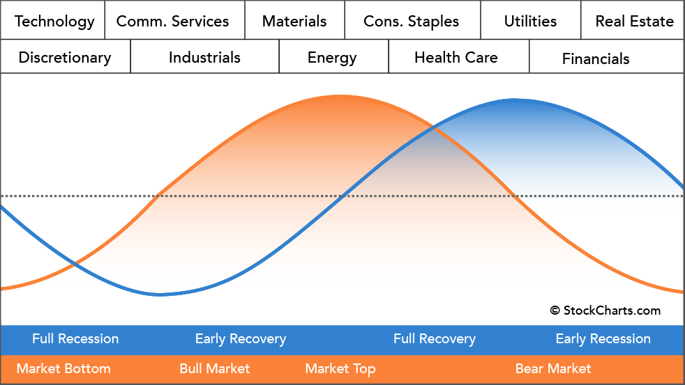

## 

### VIX(Volatility Index)
S&P500先物のオプション取引の数値を元に、「市場が今後30日でどのような変動を見込んでいるのか」を数値化している。

## Sector
+ technology(情報技術)
+ consumer cyclical, consumer Discretionary(一般消費財)
+ communication service(通信)
+ Industrials(資本財)
+ basic materials(素材)
+ energy(エネルギー)
+ consumer defensive, consumer staples(生活必需品)
+ healthcare(ヘルスケア)
+ utilities(公共事業)
+ financials(金融)
+ real estate(不動産)

青が景気循環、オレンジが株式市場循環を表現している。  

## いつ買うか
+ VIXが40を上回っているとき

## 何を買うか
+ セクターサイクル表のタイミングごとのセクター銘柄

## 何を確認するか

+ [finbiz](https://finviz.com/map.ashx)
セクター別のヒートマップが確認できる。
