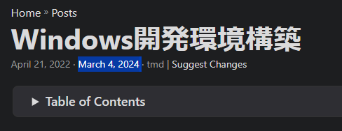

自分用のメモとして使いたいので過去記事を頻繁にアップデートしそう。
最終アップデート日付を表示したい。

[公式](https://gohugo.io/methods/page/gitinfo/#last-modified-date)によると、`enableGitInfo`が`true`なら、Lastmodでgitのコミット日時を取得してくれる模様。

### hugo.yaml

```
enableGitInfo: true
```

### html

```html
{{- if not .Lastmod.IsZero -}}
    {{- $scratch.Add "meta" (slice (printf "<span title='%s'>%s</span>" (.Lastmod) (.Lastmod | time.Format (default "January 2, 2006" site.Params.DateFormat)))) }}
{{- end }}
```

## 結果

表示できた。

